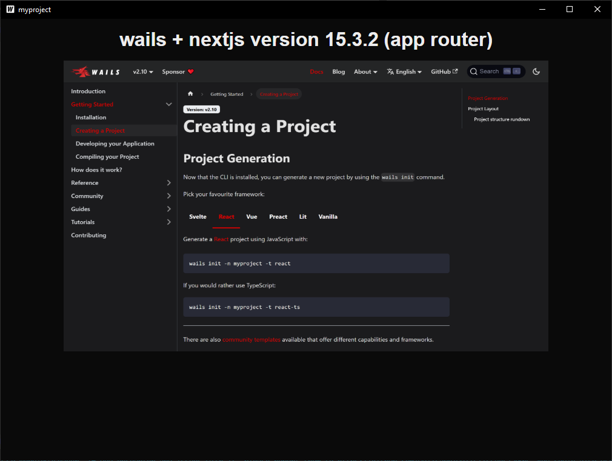

# Go Application + Next.js with Wails

A desktop application built with [Wails](https://wails.io/) (Go backend + frontend framework).

## Features

- Go backend for business logic
- Modern frontend interface
- Cross-platform support

## Development

### Prerequisites

- Go 1.18+
- Wails CLI (`go install github.com/wailsapp/wails/v2/cmd/wails@latest`)
- Node.js (for frontend dependencies)

### Running in Development Mode

```bash
wails dev
```

This launches the application with hot-reload for both frontend and backend.

## Building

To create a production build:

```bash
wails build --clean
```

Build options:
- Add `-platform windows/linux/darwin` to target specific OS
- Use `-nsis` flag on Windows to generate an installer

## Project Structure

```
.
├── build/               # Build artifacts
├── frontend/            # Frontend source code
├── go.mod               # Go dependencies
├── main.go              # Application entry point
└── ...                  # Other project files
```

## Screenshot

